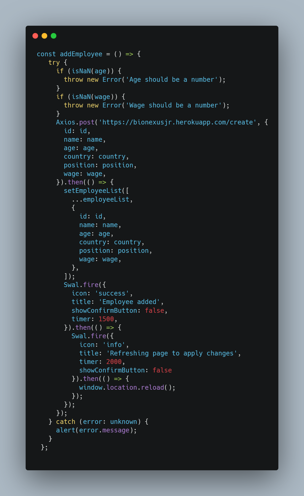
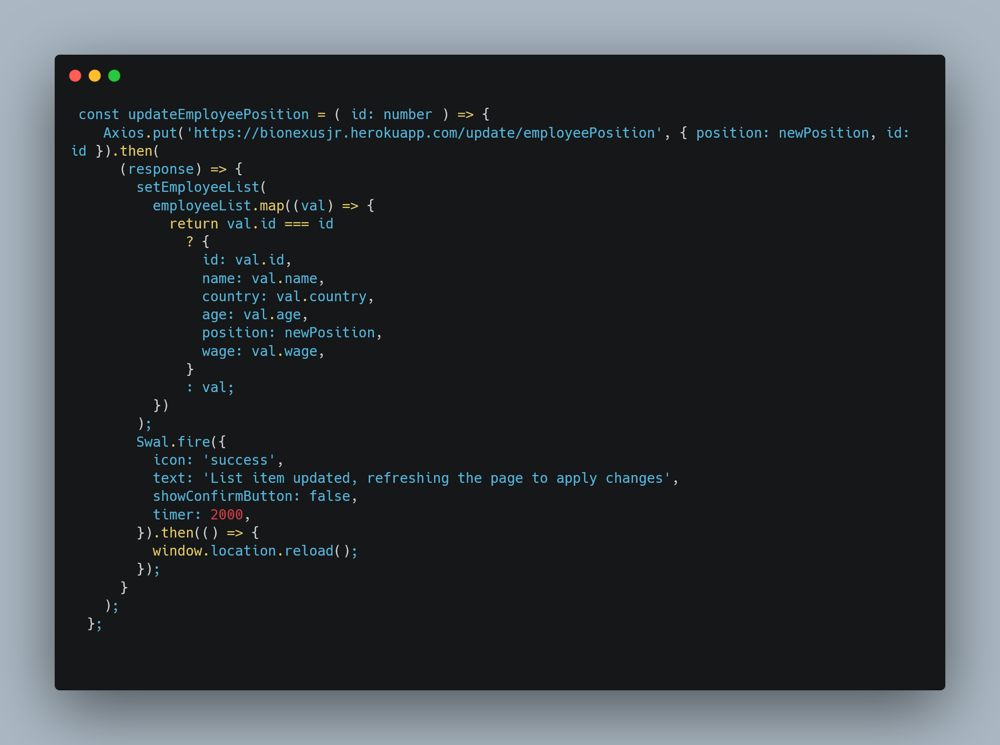
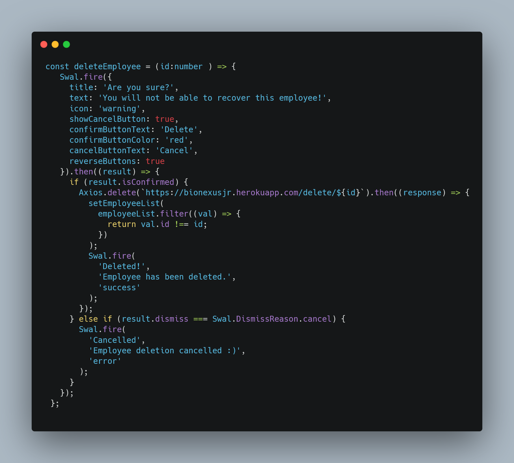
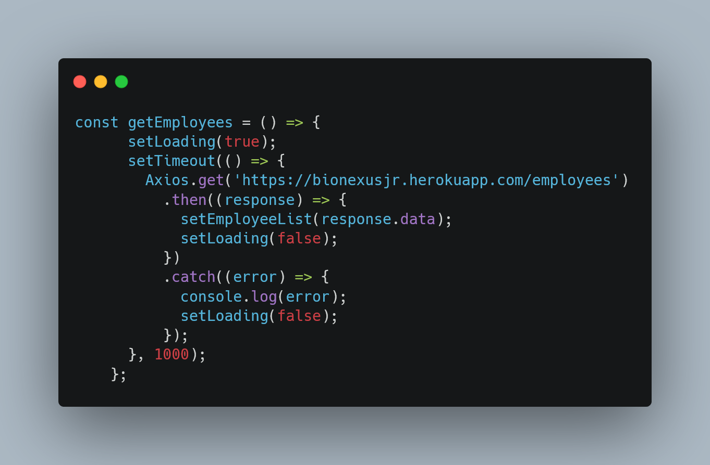

## Tech Stack

**Client:** React, TypeScript, React-Router-DOM

**Server:** Node, Express, CORS, MySQL

## Used By

This project was built with the intention of optimizing the organization and management of the company's assets:

- The core functionality of this app is based on CRUD (Create, Read, Update, and Delete)
- With this in mind, the user is able to perform these actions on the app. The app has four pages: home, employee management, consumables management and equipments management page.

## Features

- If one of the consumables is lower than 15 units, it pops up an alert that indicates which of the consumable is low in quantity
- CRUD functionalities
- Alerts that asks the user for permission to delete a certain column in the database
- Form validation: if a user types a string in a certain input that just accepts an integer, a error message will be displayed.
- Every time a column is added or updated, it triggers an alert confirming to the user what he just did and also triggers a refresh of the page in order to ensure that data is being updated in the database.
- The user is able to filter contents in each column of the database

## File Structure
### 1. src/pages
- Inside each page folder, there is a file which will loop through the columns of the mySQL database
- content: represents each column that is being looped
- index: is what renders the whole content of each page
- css styling sheets
 
### 2. src/contexts 
- It stores React's Context API. In this file we will pass down of the functions and state variables to its children, that is, each individual page on src/pages

### 3. src/components 
- It stores React components that are being shared throughout all of the application, in this case it is just the navbar

### src/assets 
- stores images that will be used in the application

## CRUD function examples for front end:

- This function sends an HTTP POST reuqest to MySQL database to add an employee to a server and updates the employee list. It also displays success and refresh messages using Swal library and catches any errors thrown during execution.

- This function sends an HTTP PUT request the MySQL database to update the position of an employee on a server. It takes an id parameter to identify the employee to update and a newPosition parameter to specify the new position. If the request is successfull, it sends an alert displaying it.

- This function sends an HTTP request to the MySQL database to remove an employee from a list, by taking the employee's ID as an argument. If the request is successfull, it shows a pop-up using the Swal library to confirm if the user really wants to delete the employee. It also

 - displays a success message if the user decides to delete. If the user clicks "Cancel", it displays a cancellation message.

 

 - This function sends a GET HTTP request to the MySQL database. Before making the request, it sets the loading state to true, indicating that the request is in progress, with a delay of 1 second using the setTimeout function. Once the response is received, it updates the employeeList state using the setEmployeeList function, with the data received from the server while also stoping the loading component.

 ## React Hooks:

- Context API
- useState
- useEffect
- React Router DOM
